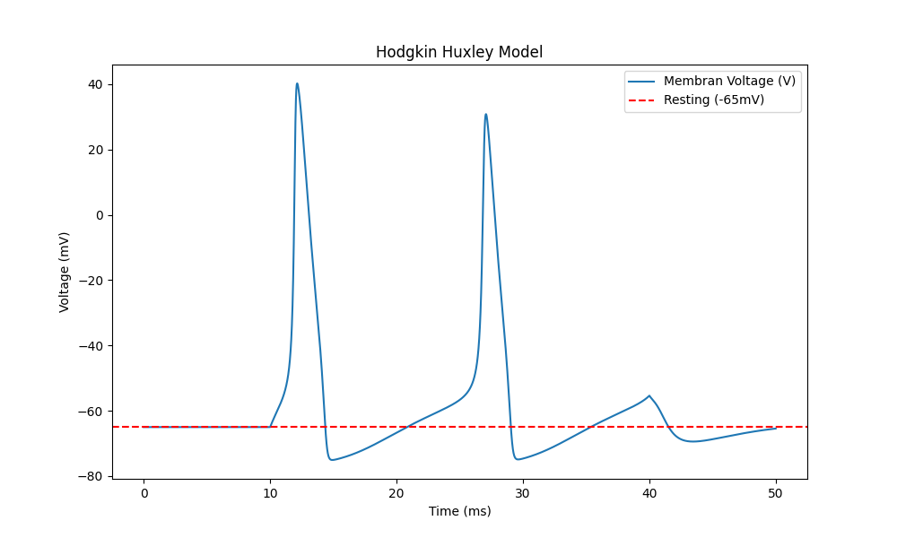

# Hodgkin-Huxley Model: Decoding the Action Potential

## Introduction
This project is a computational implementation of the Nobel Prize-winning **Hodgkin-Huxley model (1952)**. While modern neuroscience has advanced significantly, this model remains the "Gold Standard" for understanding how neurons generate and transmit electrical signals (Action Potentials).

Unlike simple phenomenological models (like Leaky Integrate-and-Fire) that artificially "reset" the voltage when it hits a threshold, **this simulation creates the spike naturally** through the non-linear biophysical dynamics of ion channels.

I built this simulation from scratch using **Python** to bridge the gap between biological theory and engineering principles.

---

a neuron is essentially a biological circuit. The cell membrane acts as a **capacitor**, separating charges, while ion channels act as **variable resistors** (conductances) that change based on voltage.

The membrane potential starts at a resting value, storing charge according to the standard capacitor formula, which I implemented using **Kirchhoff's Current Law**:

$$
C_m \frac{dV}{dt} = I_{\text{inj}} - I_{\text{Na}} - I_{\text{K}} - I_{\text{L}}
$$

Here, the constants ($g_{\text{Na}}, g_{\text{K}}, g_{\text{L}}$) define the "bandwidth" of these channels, and the reversal potentials ($E_{\text{Na}}, E_{\text{K}}, E_{\text{L}}$) act as the **batteries** driving the ionic flow. By tuning these physical properties, the model simulates realistic membrane dynamics that match biological observations.

---
he Gating Dynamics (The Biological Engine)
The magic of the spike lies in the timing. The channels don't just open; they follow specific probability functions known as gating variables ($m, h, n$).

Think of it as a race between a Gas Pedal and a Brake:

* **$\alpha_m$ & $\beta_m$ (Sodium Activation):** These govern the rapid opening of Sodium ($Na^+$) channels. This is the **"Gas Pedal"** that causes the voltage to skyrocket (Depolarization).
* **$\alpha_h$ & $\beta_h$ (Sodium Inactivation):** The safety mechanism that shuts down the sodium flow slowly.
* **$\alpha_n$ & $\beta_n$ (Potassium Activation):** Governs the delayed opening of Potassium ($K^+$) channels. This acts as the **"Brake"**, pulling the voltage back down (Repolarization).

The action potential is generated not by a single event, but by the **differential speeds** of these gates. Sodium rushes in fast to spike the voltage, but Potassium is slow to wake up, eventually restoring the resting potential.

---

## Simulation Results
Instead of using a pre-defined threshold, I implemented the full system of **4 coupled non-linear differential equations** using `scipy.integrate.odeint`.

The graph below shows the membrane potential generated dynamically on its own, reflecting the natural, chaotic, yet deterministic behavior of ionic currents.

*(The graph shows rhythmic firing when a constant current is applied between t=10ms and t=40ms)*

---

##  Technologies Used
* **Python:** Core logic and simulation.
* **SciPy (`odeint`):** For solving the system of differential equations.
* **NumPy:** Vectorized numerical operations.
* **Matplotlib:** Data visualization.
